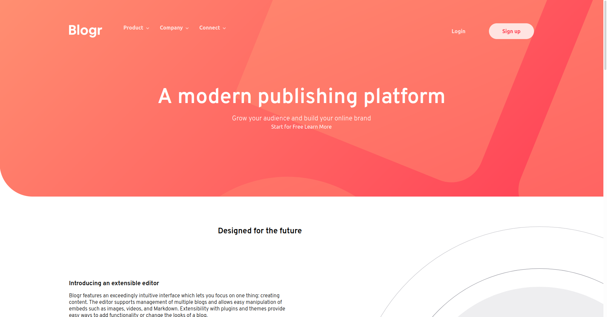

# Frontend Mentor - Blogr landing page solution

This is a solution to the [Blogr landing page challenge on Frontend Mentor](https://www.frontendmentor.io/challenges/blogr-landing-page-EX2RLAApP). Frontend Mentor challenges help you improve your coding skills by building realistic projects. 

## Table of contents

- [Overview](#overview)
  - [The challenge](#the-challenge)
  - [Screenshot](#screenshot)
  - [Links](#links)
- [My process](#my-process)
  - [Built with](#built-with)
  - [What I learned](#what-i-learned)
- [Author](#author)

## Overview

### The challenge

Users should be able to:

- View the optimal layout for the site depending on their device's screen size
- See hover states for all interactive elements on the page

### Screenshot

### Links

- Solution URL: [Solution URL](https://marcustuliusciceron.github.io/Blogr-landing-page/)

## My process

### Built with

- Semantic HTML5 markup
- CSS custom properties
- Flexbox
- CSS Grid
- Mobile-first workflow

### What I learned

I first Built the Header section. I build desktop style first then mobile. For the desktop style I decided to add an event listener on the whole page so the user will be able to close the dropdown nav menu by clicking anywhere outside the menu.
For the mobile hamburger menu I use the details landmark that allow to build an accordeon whithout js.

Rest of the page is pretty standard layout

## Author

- Frontend Mentor - [@yourusername](https://www.frontendmentor.io/profile/MarcusTuliusCiceron)
